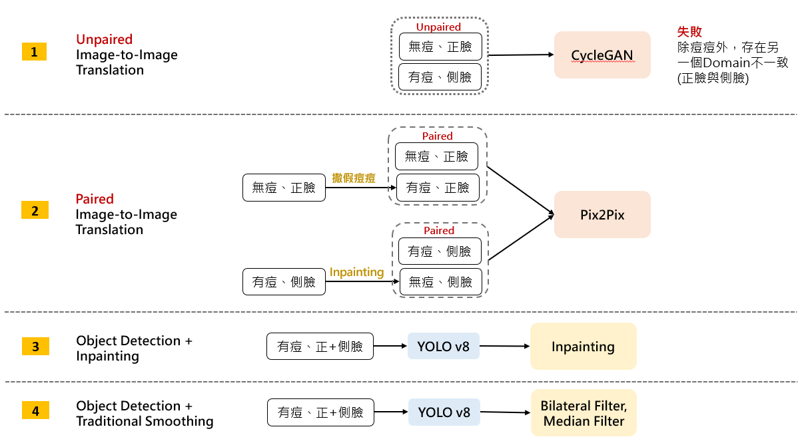
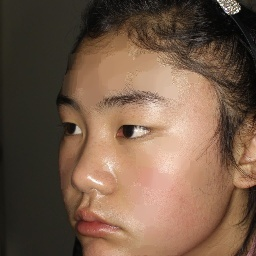
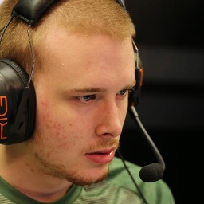

# Rescue the Acne Face
## Goal
我們的目標是通過深度學習技術實現臉部痘痘的去除。痘痘不僅影響美觀，還可能對人們的自信心造成影響。為了實現這一目標，我們探索並比較了多種圖像處理方法，包括 YOLO + Inpainting 和 Pix2Pix 等等。

## Contain
以下簡單說明每個資料夾內的方法與用途:
- **YOLO**: 含有YOLO v8我們的使用方式與說明

- **Inpainting**: 含有inpainting的使用方式與流程。

- **Filter**: 含有Filter的使用與說明

- **pix2pix**: 含有資料前處理與pix2pix模型。

- **Result**: 問卷分析的方式與過程。

- **RescueAcneFace_Report.pdf**: 書面報告。

- **RescueAcneFace_Oral.pdf**: 簡報。

## Method Overview

## Result
### 實際照片結果對比：

<table>
    <tr>
        <th style="text-align:center">Original</th>
        <th style="text-align:center">Median Filter</th>
        <th style="text-align:center">Inpainting</th>
        <th style="text-align:center">Pix2Pix</th>
    </tr>
    <tr>
        <td style="text-align:center"></td>
        <td style="text-align:center"></td>
        <td style="text-align:center"></td>
        <td style="text-align:center"></td>
    </tr>
    <tr>
        <td style="text-align:center"></td>
        <td style="text-align:center"></td>
        <td style="text-align:center"></td>
        <td style="text-align:center"></td>
    </tr>
</table>

### 問卷結果  

| 正臉生活痘痘照   | 去除效果 | 自然度| 真實度 |
|---------------|-----------------------------------|-------------------------|---------------------|
| Median Filter | 3.55 ± 0.98                      | 2.53 ± 1.13             | 2.58 ± 1.11         |
| Inpainting    | 4.10 ± 0.66                      | 3.73 ± 0.90             | 3.63 ± 0.95         |
| Pix2Pix       | 2.83 ± 0.98                      | 3.22 ± 0.96             | 3.21 ± 1.00         |

| 側臉痘痘特寫照   | 去除效果 | 自然度| 真實度 |
|---------------|-----------------------------------|-------------------------|---------------------|
| Median Filter | 3.19 ± 1.07                      | 3.40 ± 0.90             | 2.23 ± 1.00         |
| Inpainting    | 3.80 ± 0.87                      | 3.73 ± 0.81             | 3.67 ± 0.87         |
| Pix2Pix       | 3.40 ± 0.90                      | 3.27 ± 0.97             | 3.27 ± 0.98         |

| 全部痘痘照   | 去除效果 | 自然度| 真實度 |
|---------------|-----------------------------------|-------------------------|---------------------|
| Median Filter | 3.38 ± 1.04                      | 2.36 ± 1.07             | 2.42 ± 1.07         |
| Inpainting    | 3.96 ± 0.78                      | 3.73 ± 0.86             | 3.65 ± 0.92         |
| Pix2Pix       | 3.10 ± 0.99                      | 3.24 ± 0.97             | 3.24 ± 0.99         |
