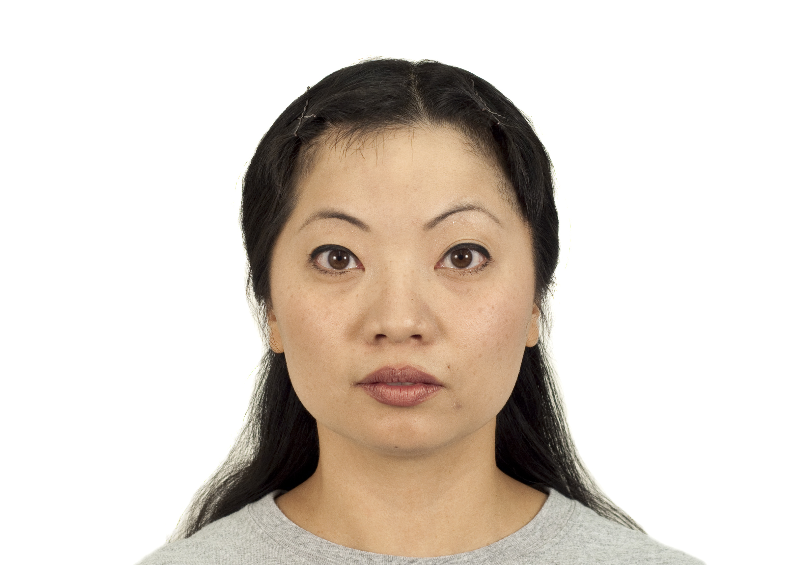
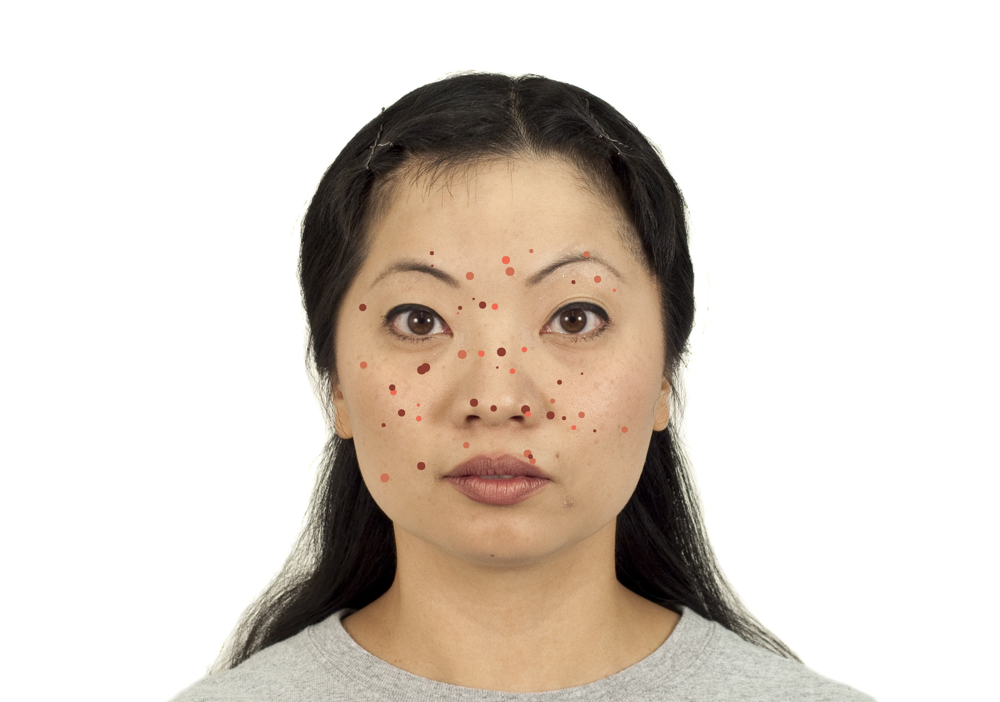
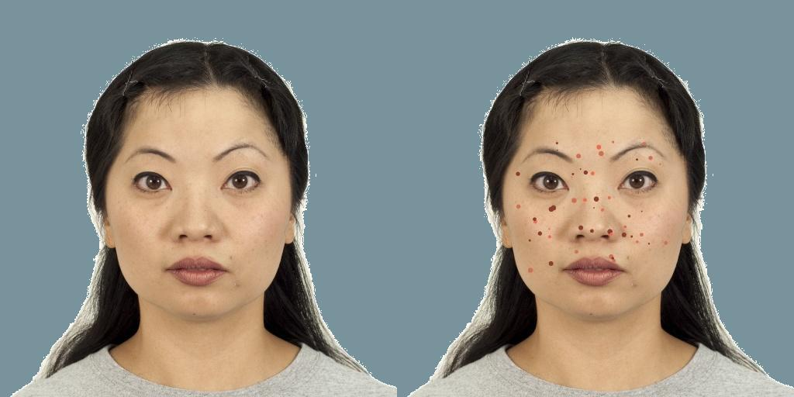
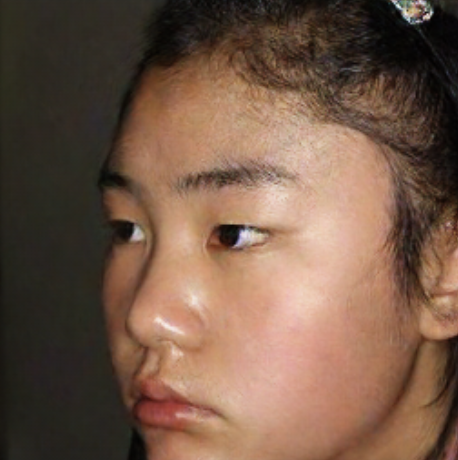

# Pix2Pix
## Usage
- **Add simulate acne**: `noise.ipynb`
- **Train & Test pix2pix model**: `pix2pix.ipynb`

## Preprocess data
`noise.ipynb`內有許多cells，分別是:
1. **Add acne to face**: 幫助加許多模擬人類真實痘痘的noise到臉上。

    | Original clear face             | Add simulate acne face            |
    | ------------------------- | ------------------------- |
    |  |  |

2. **Cut and resized images**: 依照設置的裁剪範圍以及大小對圖片進行處理。
3. **Rename the Images**: 重新命名圖片名稱，方便後續合併兩張圖片時的作業。
4. **Merge two images**: 因為pix2pix官方模型不管在訓練還是測試的時候，都必須吃aligned過後的NoAcne-Acne照片，所以最後只會有一張照片，左邊是NoAcne右邊是Acne照片，所以我們必須merge兩張圖片。
5. **Change the background color (random)**: 由於在訓練時發現我們的datasets的背景都是白色的，所以生出的人臉很容易臉上會有類似反光白白的東西，為了解決這個問題，於是決定隨機生成一些低飽和度的顏色當作圖片背景。


## Train & Test pix2pix model
我們使用的baseline模型是[Jun-Yan Zhu](https://github.com/junyanz) and [Taesung Park](https://github.com/taesungp)作者的pytorch-CycleGAN-and-pix2pix模型，在我們提供的`pix2pix.ipynb` 裡面下載或是放上自己收集的datasets，即可訓練以及測試此model。

## Result
Before| After             ||
|-------| ------------------------- | ------------------------- |
|  |  |

## Acknowledgements & Reference
- [junyanz/pytorch-CycleGAN-and-pix2pix](https://github.com/junyanz/pytorch-CycleGAN-and-pix2pix)
```
@inproceedings{CycleGAN2017,
  title={Unpaired Image-to-Image Translation using Cycle-Consistent Adversarial Networks},
  author={Zhu, Jun-Yan and Park, Taesung and Isola, Phillip and Efros, Alexei A},
  booktitle={Computer Vision (ICCV), 2017 IEEE International Conference on},
  year={2017}
}

@inproceedings{isola2017image,
  title={Image-to-Image Translation with Conditional Adversarial Networks},
  author={Isola, Phillip and Zhu, Jun-Yan and Zhou, Tinghui and Efros, Alexei A},
  booktitle={Computer Vision and Pattern Recognition (CVPR), 2017 IEEE Conference on},
  year={2017}
}
```